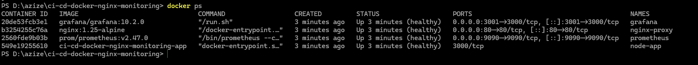
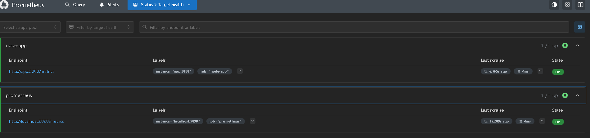
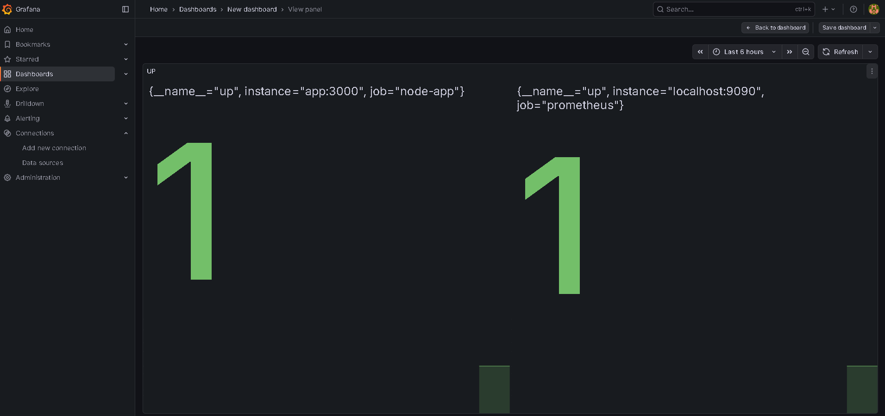
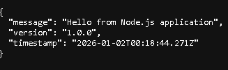
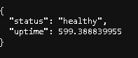

# CI/CD Docker Nginx Monitoring

A production-ready Docker setup featuring a Node.js application with Nginx reverse proxy, Prometheus metrics collection, and Grafana visualization. Includes GitHub Actions CI/CD pipeline.


## Architecture

```
                                    ┌─────────────────┐
                                    │   GitHub Actions │
                                    │      CI/CD       │
                                    └────────┬────────┘
                                             │
                                             ▼
┌─────────────────────────────────────────────────────────────────┐
│                        Docker Network                            │
│                                                                  │
│  ┌──────────┐      ┌──────────┐      ┌────────────┐             │
│  │  Nginx   │──────│ Node.js  │◄─────│ Prometheus │             │
│  │  :80     │      │  :3000   │      │   :9090    │             │
│  └──────────┘      └──────────┘      └─────┬──────┘             │
│                          │                  │                    │
│                          │ /metrics         │                    │
│                          ▼                  ▼                    │
│                    ┌──────────────────────────┐                  │
│                    │        Grafana           │                  │
│                    │         :3001            │                  │
│                    └──────────────────────────┘                  │
└─────────────────────────────────────────────────────────────────┘
```

## Features

- **Node.js Application**: Express.js server with Prometheus metrics instrumentation
- **Nginx Reverse Proxy**: Load balancing and request routing
- **Prometheus**: Metrics collection and storage
- **Grafana**: Pre-configured dashboards for visualization
- **Health Checks**: All services include Docker health checks
- **GitHub Actions**: Automated CI/CD pipeline
- **Environment Variables**: Configurable via `.env` file

## Quick Start

### Prerequisites

- Docker Engine 20.10+
- Docker Compose 2.0+

### Installation

1. **Clone the repository**
   ```bash
   git clone https://github.com/azize-devops/ci-cd-docker-nginx-monitoring.git
   cd ci-cd-docker-nginx-monitoring
   ```

2. **Configure environment (optional)**
   ```bash
   cp .env.example .env
   # Edit .env file as needed
   ```

3. **Start all services**
   ```bash
   docker compose up -d --build
   ```

4. **Verify services are running**
   ```bash
   docker ps
   ```

## Service Endpoints

| Service | URL | Description |
|---------|-----|-------------|
| Application | http://localhost | Main application |
| Health Check | http://localhost/health | Application health status |
| Metrics | http://localhost/metrics | Prometheus metrics endpoint |
| Prometheus | http://localhost:9090 | Prometheus UI |
| Grafana | http://localhost:3001 | Grafana dashboards |

## Screenshots

### Docker Containers Running


### Prometheus Targets


### Grafana Dashboard


### Application Root Endpoint


### Health Check Endpoint


## Project Structure

```
ci-cd-docker-nginx-monitoring/
├── .github/
│   └── workflows/
│       └── ci.yml              # GitHub Actions CI pipeline
├── app/
│   ├── src/
│   │   └── index.js            # Node.js application
│   ├── Dockerfile              # Multi-stage Docker build
│   ├── package.json
│   └── package-lock.json
├── nginx/
│   └── nginx.conf              # Nginx configuration
├── prometheus/
│   └── prometheus.yml          # Prometheus configuration
├── grafana/
│   └── provisioning/
│       ├── datasources/
│       │   └── prometheus.yml  # Datasource configuration
│       └── dashboards/
│           ├── dashboards.yml  # Dashboard provider config
│           └── node-app.json   # Application dashboard
├── docs/
│   └── screenshots/            # Documentation screenshots
├── docker-compose.yml          # Docker Compose configuration
├── .env.example                # Environment variables template
├── .gitignore
└── README.md
```

## Configuration

### Environment Variables

| Variable | Default | Description |
|----------|---------|-------------|
| `NODE_ENV` | production | Node.js environment |
| `APP_PORT` | 3000 | Application port |
| `NGINX_PORT` | 80 | Nginx exposed port |
| `PROMETHEUS_PORT` | 9090 | Prometheus exposed port |
| `GRAFANA_PORT` | 3001 | Grafana exposed port |
| `GF_SECURITY_ADMIN_USER` | admin | Grafana admin username |
| `GF_SECURITY_ADMIN_PASSWORD` | admin | Grafana admin password |
| `GF_USERS_ALLOW_SIGN_UP` | false | Allow user sign up |

### Grafana Access

- **URL**: http://localhost:3001
- **Username**: admin
- **Password**: admin (change in production!)

## Available Metrics

The application exposes the following Prometheus metrics:

| Metric | Type | Description |
|--------|------|-------------|
| `http_requests_total` | Counter | Total HTTP requests by method, route, status |
| `http_request_duration_seconds` | Histogram | Request duration distribution |
| `process_cpu_seconds_total` | Counter | CPU time used |
| `process_resident_memory_bytes` | Gauge | Memory usage |
| `nodejs_eventloop_lag_seconds` | Gauge | Event loop lag |

## CI/CD Pipeline

The GitHub Actions workflow (`.github/workflows/ci.yml`) runs on:
- Push to `main` or `develop` branches
- Pull requests to `main`

### Pipeline Steps

1. Checkout repository
2. Set up Docker Buildx
3. Build application image
4. Validate Docker Compose configuration
5. Start all services
6. Run health checks
7. Clean up

## Development

### Running Locally

```bash
# Start services
docker compose up -d --build

# View logs
docker compose logs -f

# Stop services
docker compose down

# Stop and remove volumes
docker compose down -v
```

### Rebuilding a Single Service

```bash
docker compose up -d --build app
```

### Viewing Logs

```bash
# All services
docker compose logs -f

# Specific service
docker compose logs -f app
```

## Monitoring

### Prometheus Queries

```promql
# Request rate
rate(http_requests_total[1m])

# 95th percentile latency
histogram_quantile(0.95, rate(http_request_duration_seconds_bucket[5m]))

# Error rate
sum(rate(http_requests_total{status=~"5.."}[5m])) / sum(rate(http_requests_total[5m]))
```

### Pre-configured Dashboard

Grafana comes with a pre-configured "Node.js Application" dashboard showing:
- HTTP Request Rate
- Request Duration (p50, p95)
- Total Requests
- CPU Usage
- Memory Usage
- Uptime

## Troubleshooting

### Containers not starting

```bash
# Check container status
docker ps -a

# Check logs
docker compose logs

# Restart services
docker compose restart
```

### Health check failing

```bash
# Check specific container health
docker inspect --format='{{json .State.Health}}' node-app

# Test endpoint manually
curl http://localhost/health
```

### Grafana datasource not working

Ensure Prometheus is running and accessible:
```bash
curl http://localhost:9090/-/healthy
```

## Contributing

1. Fork the repository
2. Create a feature branch (`git checkout -b feature/amazing-feature`)
3. Commit changes (`git commit -m 'Add amazing feature'`)
4. Push to branch (`git push origin feature/amazing-feature`)
5. Open a Pull Request

## License

This project is licensed under the MIT License - see the [LICENSE](LICENSE) file for details.

## Acknowledgments

- [Express.js](https://expressjs.com/)
- [prom-client](https://github.com/siimon/prom-client)
- [Prometheus](https://prometheus.io/)
- [Grafana](https://grafana.com/)
- [Nginx](https://nginx.org/)
